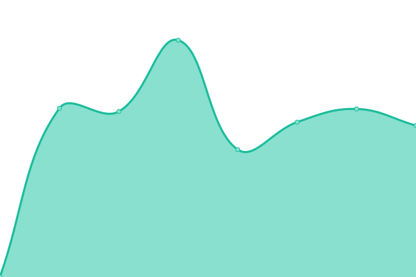

# [📈 Live Status](https://hansen-distribution.github.io/upptime): <!--live status--> **🟥 Complete outage**

This repository contains the open-source uptime monitor and status page for [Hansen-Distribution](https://hansen-distribution.github.io/upptime), powered by [Upptime](https://github.com/upptime/upptime).

With [Upptime](https://upptime.js.org), you can get your own unlimited and free uptime monitor and status page, powered entirely by a GitHub repository. We use [Issues](https://github.com/Hansen-Distribution/upptime/issues) as incident reports, [Actions](https://github.com/Hansen-Distribution/upptime/actions) as uptime monitors, and [Pages](https://hansen-distribution.github.io/upptime/) for the status page.

<!--start: status pages-->
<!-- This summary is generated by Upptime (https://github.com/upptime/upptime) -->
<!-- Do not edit this manually, your changes will be overwritten -->
<!-- prettier-ignore -->
| URL | Status | History | Response Time | Uptime |
| --- | ------ | ------- | ------------- | ------ |
|  [Helite US Site](https://www.heliteus.com) | 🟥 Down | [helite-us-site.yml](https://github.com/Hansen-Distribution/upptime/commits/HEAD/history/helite-us-site.yml) | 

 283ms
     
 | 

<a href="https://Hansen-Distribution.github.io/upptime/history/helite-us-site">100.00%</a>
    

|  [Helite US App](https://app.heliteus.com) | 🟥 Down | [helite-us-app.yml](https://github.com/Hansen-Distribution/upptime/commits/HEAD/history/helite-us-app.yml) | 

 576ms
     
 | 

<a href="https://Hansen-Distribution.github.io/upptime/history/helite-us-app">99.34%</a>
    

|  [Helite US IHSA](https://sponsorship.heliteus.com) | 🟥 Down | [helite-us-ihsa.yml](https://github.com/Hansen-Distribution/upptime/commits/HEAD/history/helite-us-ihsa.yml) | 

 358ms
     
 | 

<a href="https://Hansen-Distribution.github.io/upptime/history/helite-us-ihsa">99.37%</a>
    

|  [Helite US USHJA](https://ushja.heliteus.com) | 🟥 Down | [helite-us-ushja.yml](https://github.com/Hansen-Distribution/upptime/commits/HEAD/history/helite-us-ushja.yml) | 

 343ms
     
 | 

<a href="https://Hansen-Distribution.github.io/upptime/history/helite-us-ushja">99.39%</a>
    

|  [Helite US Retailer Registration](https://retailer.heliteus.com) | 🟥 Down | [helite-us-retailer-registration.yml](https://github.com/Hansen-Distribution/upptime/commits/HEAD/history/helite-us-retailer-registration.yml) | 

 406ms
     
 | 

<a href="https://Hansen-Distribution.github.io/upptime/history/helite-us-retailer-registration">99.80%</a>
    

|  [Helite US Ambassador Registration](https://ambassador.heliteus.com) | 🟥 Down | [helite-us-ambassador-registration.yml](https://github.com/Hansen-Distribution/upptime/commits/HEAD/history/helite-us-ambassador-registration.yml) | 

 428ms
     
 | 

<a href="https://Hansen-Distribution.github.io/upptime/history/helite-us-ambassador-registration">99.81%</a>
    

|  [Helite US Shop](https://shop.heliteus.com) | 🟥 Down | [helite-us-shop.yml](https://github.com/Hansen-Distribution/upptime/commits/HEAD/history/helite-us-shop.yml) | 

 303ms
     
 | 

<a href="https://Hansen-Distribution.github.io/upptime/history/helite-us-shop">100.00%</a>
    

|  [Egide US Site](https://www.egideus.com) | 🟥 Down | [egide-us-site.yml](https://github.com/Hansen-Distribution/upptime/commits/HEAD/history/egide-us-site.yml) | 

 368ms
     
 | 

<a href="https://Hansen-Distribution.github.io/upptime/history/egide-us-site">100.00%</a>
    

|  [Egide US API](https://api.egideus.com) | 🟥 Down | [egide-us-api.yml](https://github.com/Hansen-Distribution/upptime/commits/HEAD/history/egide-us-api.yml) | 

 558ms
     
 | 

<a href="https://Hansen-Distribution.github.io/upptime/history/egide-us-api">100.00%</a>
    

<!--end: status pages-->

[**Visit our status website →**](https://hansen-distribution.github.io/upptime/)

## 📄 License

- Powered by: [Upptime](https://github.com/upptime/upptime)
- Code: [MIT](./LICENSE) © [Hansen-Distribution](https://hansen-distribution.github.io/upptime/)
- Data in the `./history` directory: [Open Database License](https://opendatacommons.org/licenses/odbl/1-0/)
